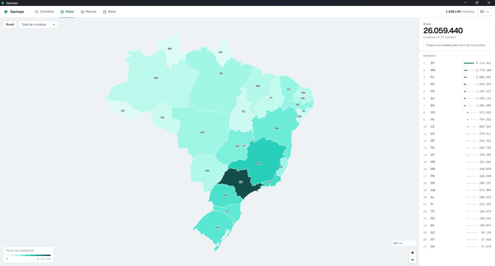

# Garimpo

Aplicativo desktop para transformar o cadastro aberto de CNPJ em uma base de
prospecção pesquisável, priorizada e pronta para exportar.



O Garimpo encontra empresas ativas, organiza os contatos em uma base local e
ajuda a priorizar quem pode comprar site, sistema, aplicativo ou automação.
Os dados ficam no seu computador; não há servidor, conta ou mensalidade.

## Recursos

- **Base local e offline:** cada UF vira um banco SQLite independente, fácil de
  consultar e apagar sem afetar as outras.
- **Busca e filtros:** encontre por nome, empresa, município, ramo, porte,
  score e disponibilidade de celular ou e-mail.
- **Mapa interativo:** navegue de Brasil para estado e municípios; um clique
  abre a lista de contatos daquela região.
- **Ranking de ramos:** compare volume, score e qualidade de contato por
  segmento de atividade.
- **Exportação para DataRunner:** envie a seleção ou um recorte filtrado para
  Excel no formato do importador.
- **Processamento em segundo plano:** acompanhe o download e a geração da base
  sem interromper o restante do aplicativo.

## Começar

### Baixar o aplicativo pronto

Os instaladores de Windows e Linux estão em
[Releases](https://github.com/ivobraatz/garimpo/releases/latest). Eles incluem
o motor de processamento do Garimpo: para usar o aplicativo instalado não é
necessário instalar Python, Node.js nem Rust.

- **Windows:** baixe o arquivo `.exe` (instalador recomendado) ou `.msi` para
  distribuição por equipes de TI.
- **Linux:** baixe o `.AppImage` (distribuição genérica; marque-o como
  executável) ou o `.deb` para Debian e Ubuntu.

As versões publicadas preservam a sua pasta de dados. Antes de publicar uma
versão, crie e envie a tag que corresponde à versão do projeto, por exemplo:

```bash
git tag v0.1.0
git push origin v0.1.0
```

O GitHub Actions cria uma Release como rascunho com os quatro formatos; revise
os arquivos e publique o rascunho para disponibilizá-los.

### Requisitos para desenvolvimento

- Windows ou Linux com Python 3 disponível no `PATH`
- Node.js e npm
- Rust, caso queira compilar o aplicativo Tauri

No Linux, a compilação do Tauri também requer WebKitGTK e as bibliotecas de
empacotamento. O workflow de Release contém a lista usada no Ubuntu 22.04.

```bash
git clone https://github.com/ivobraatz/garimpo.git
cd garimpo

python -m venv .venv
```

Ative o ambiente com `.venv\Scripts\Activate.ps1` no PowerShell ou
`source .venv/bin/activate` no Linux. Em seguida:

```bash
pip install -r requirements.txt

cd app
npm ci
npm run app
```

O comando abre o aplicativo em modo de desenvolvimento. Para atualizar somente
a interface no navegador, use `npm run dev`.

### Gerar o instalador localmente

Com as dependências Python já instaladas, inclua também o PyInstaller para
montar o motor de processamento dentro do instalador:

```bash
pip install pyinstaller
```

Depois execute:

```bash
cd app
npm run app:build
```

No Windows, os instaladores NSIS e MSI são gerados em
`app/src-tauri/target/release/bundle/`. No Linux, a mesma rotina gera AppImage
e DEB quando as dependências nativas do Tauri estão instaladas.

> A compilação local ainda usa Python para criar o pacote; o instalador gerado
> não exige Python na máquina de quem o instalar.

## Uso pelo aplicativo

1. Abra a aba **Base**.
2. Marque uma ou mais UFs.
3. Mantenha **Baixar o cadastro** selecionado na primeira execução.
4. Clique em **Baixar** e acompanhe o progresso na barra superior.

Os arquivos da Receita são nacionais: baixar várias UFs de uma vez não repete
o download. Depois de gerar a base, use as abas **Contatos**, **Mapa** e
**Ramos** para explorar as oportunidades.

As malhas do IBGE são salvas localmente em `ibge/`. Caso uma base mais antiga
não tenha a malha de uma UF, o Garimpo baixa somente esse arquivo ao abrir o
mapa; não é necessário reprocessar os contatos.

## Linha de comando

Os mesmos fluxos funcionam sem a interface:

```bash
# Baixa e gera uma UF
python src/ingestar_receita.py --uf SC
python src/gerar_leads.py --uf SC

# Um único download para várias UFs
python src/ingestar_receita.py --uf SC PR SP
python src/gerar_leads.py --uf SC
python src/gerar_leads.py --uf PR
python src/gerar_leads.py --uf SP

# Armazena os dados em outra unidade
python src/ingestar_receita.py --uf SC --dados "D:/GarimpoDados"
python src/gerar_leads.py --uf SC --dados "D:/GarimpoDados"

# Exporta um recorte para Excel
python src/exportar.py --uf SC --cidade Blumenau
python src/exportar.py --uf SC --por-segmento
python src/exportar.py --uf SC --ids 12,45,88
```

Sem `--dados`, os scripts usam `data/` na raiz do projeto.

## Dados e armazenamento

No aplicativo instalado, os dados vão por padrão para
`%LOCALAPPDATA%\Garimpo`. Em **Base → Armazenamento → Trocar**, escolha outra
pasta; os dados existentes são movidos junto e continuam separados da
instalação do programa.

```text
<pasta de dados>/receita/  arquivos recortados da Receita Federal
<pasta de dados>/uf/SC/    contatos.db e relatório da geração
<pasta de dados>/ibge/     malhas usadas pelo mapa
```

Uma atualização do aplicativo não altera essa pasta. Para dimensionar o disco,
reserve cerca de 7 GB para os arquivos nacionais baixados e espaço adicional
para as UFs que pretende gerar.

## Como o score funciona

O score prioriza oportunidades comerciais, com máximo de 100 pontos:

| Critério | Pontos |
| --- | ---: |
| Peso comercial do ramo | × 2,5 |
| Tem celular | +20 |
| Tem e-mail | +15 |
| E-mail em provedor gratuito | +10 |
| Porte pequeno ou médio/grande | +10 / +20 |
| Matriz | +5 |
| Aberta há três anos ou mais | +5 |

Os pesos por ramo ficam em `src/cnae.py`. O score é uma ferramenta de
priorização, não uma garantia de intenção de compra.

## Fontes e limites

- **Dados Abertos CNPJ da Receita Federal:** situação cadastral, CNAE, porte,
  contatos e endereço. O download usa o espelho da
  [Casa dos Dados](https://dados-abertos-rf-cnpj.casadosdados.com.br/).
- **IBGE:** códigos de municípios e malhas geográficas do mapa.
- A situação ativa no cadastro não garante que a empresa esteja operando.
- Endereços de MEIs podem ser residenciais, e a reconstrução do nono dígito de
  telefones antigos pode gerar números inválidos.

## Uso responsável

Contato de pessoa jurídica é dado público, mas MEIs e empresários individuais
podem ter e-mail e telefone pessoais no cadastro. Ao prospectar, identifique-se,
explique como chegou ao contato, ofereça descadastro e respeite a LGPD.

## Estrutura

```text
src/               pipeline Python: Receita, IBGE, SQLite e exportação
app/src/           interface Next.js
app/src-tauri/     backend Rust e empacotamento Tauri
docs/images/       imagens da documentação
```

## Licença

Copyright © 2026 Ivo Braatz.

O Garimpo é distribuído sob a [GNU Affero General Public License v3.0](LICENSE)
(`AGPL-3.0-only`).
